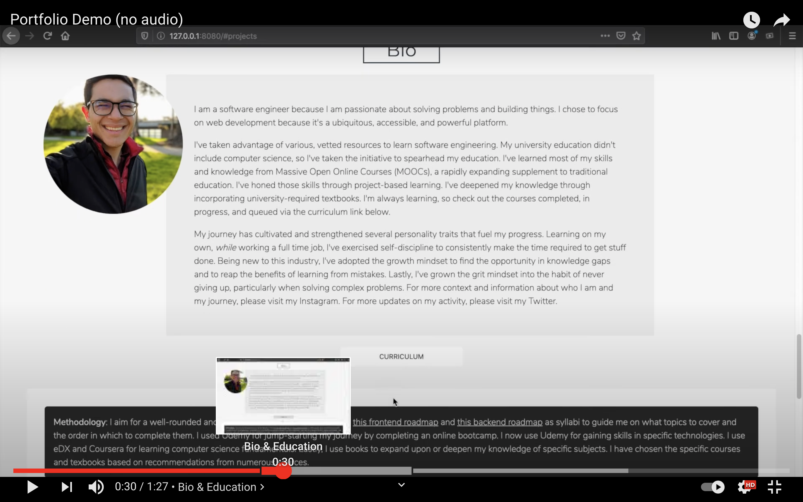

# [Portfolio](https://www.jacobgrisham.com/)
[](https://codeclimate.com/github/JacobGrisham/Professional-Portfolio/maintainability)
[](https://www.codacy.com/gh/JacobGrisham/Professional-Portfolio/dashboard?utm_source=github.com&amp;utm_medium=referral&amp;utm_content=JacobGrisham/Professional-Portfolio&amp;utm_campaign=Badge_Grade)
[](https://app.circleci.com/pipelines/github/JacobGrisham/Professional-Portfolio)

## ▶️ Walkthrough on Youtube
[](https://youtu.be/hcrmmneYZkc)

## 🖥 [Live Application](https://www.jacobgrisham.com/)

## Table of Contents
-   [Technologies](#technologies)
-   [Methodology](#methodology)
-   [Project Status](#project-status)
-   [Getting Started](#getting-started)
-   [Tests](#tests)
-   [License](#license)

## 🛠 Technologies
|Graphic Design|Front-End|Back-End|Database|Deployment|Testing |
|------------- | ------- | ------ | ------ | -------- | -------|
|Inkscape	     |HTML5	   |Node.js |.       |CircleCI	|Jest    |
|.			       |CSS3		 |ExpressJS|.      |Git       |Lighthouse |
|.			       |Sass     |EJS	    |.		   |Heroku    |.       |
|.			       |Javascript|.		  |.		   |.		      |.       |

## ⚖️ Methodology
-   [ExpressJS](https://expressjs.com/) as the Node.js application framework for its basic functionality. Some companies still use ExpressJS so it was important to implement it.
-   [Heroku](https://www.heroku.com/) due to the simplicity of the website

To Do:
-   Create version 2.0 with React and Gatsby

## ✅ Project Status
-   Complete

## 🚀 Getting Started
To run this project, install it locally using npm:

```
$ npm install
$ npm start
```
Copy and paste into browser: localhost:3000

## 📐 Tests
-   Add test

## 🔒 License
Copyright Notice and Statement: currently not offering any license. Permission only to view and download.
